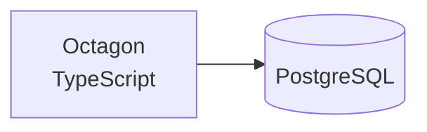

# Octagon

Octagon is a small ORM for TypeScript and PostgreSQL where tables are defined as classes that extend a `Model` base with typed fields such as `StringField` and `IntegerField`. It parses model files with acorn to create the matching tables and gives each model `save`, `filter`, `update` and `delete` methods that run queries through the `pg` driver.

